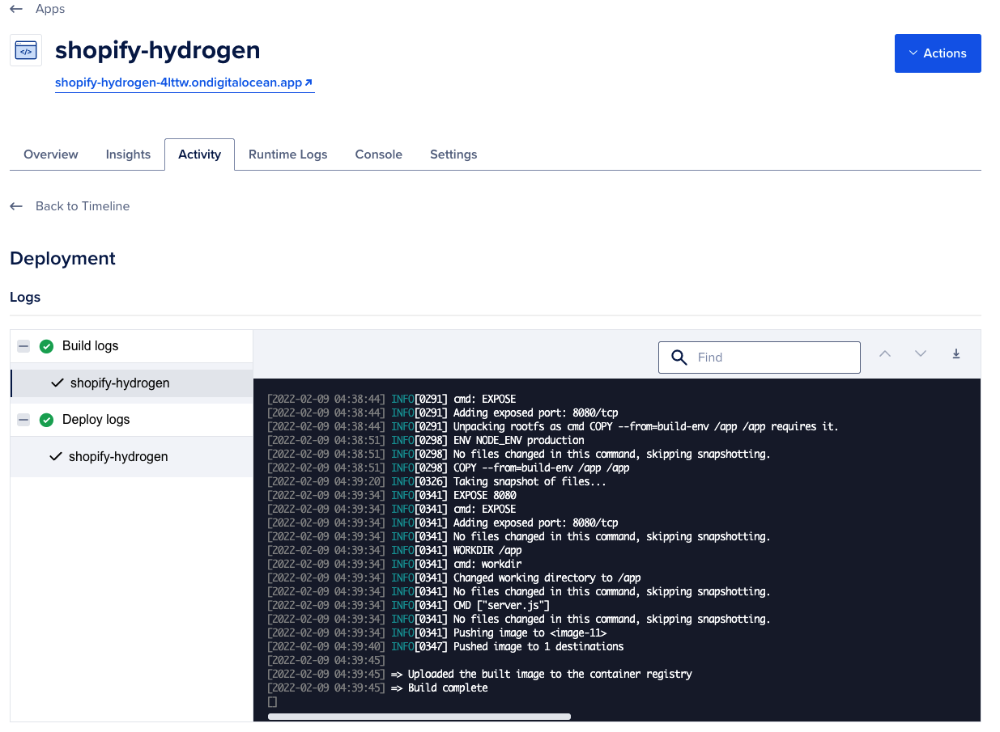

# Docker + Shopify Hydrogen + Digital Ocean

## Deploy Hydrogen Demo Theme to [Digital Ocean](https://m.do.co/c/c3a8c6b3f90b)

You can prepare a simple [$5 Droplet](https://m.do.co/c/c3a8c6b3f90b) to run it, using [my link](https://m.do.co/c/c3a8c6b3f90b) I'm giving $100 to start your server.

Click this button to deploy the app to the DigitalOcean App Platform. If you are not logged in, you will be prompted to log in with your DigitalOcean account.

## Demo

